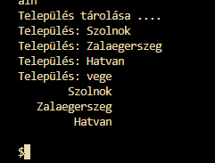

# Használói dokumentáció

## Célok

A program célja települések bekérése, tömbben tárolása, ennek gyakorlása.

## Indítás

Szükséges:

* Telepített Java SE
* VSCode
* Bővítmények:
    * Extension Pack for Java

VSCode-ban betöltjük a projekt könyvtárát,
majd futtatjuk a Java kiterjesztéssel.

## Használat

Indítás után a program azonnal bekéri a települések nevét, "vege" végjelig.

A bekért településneveket megjeleníti.

